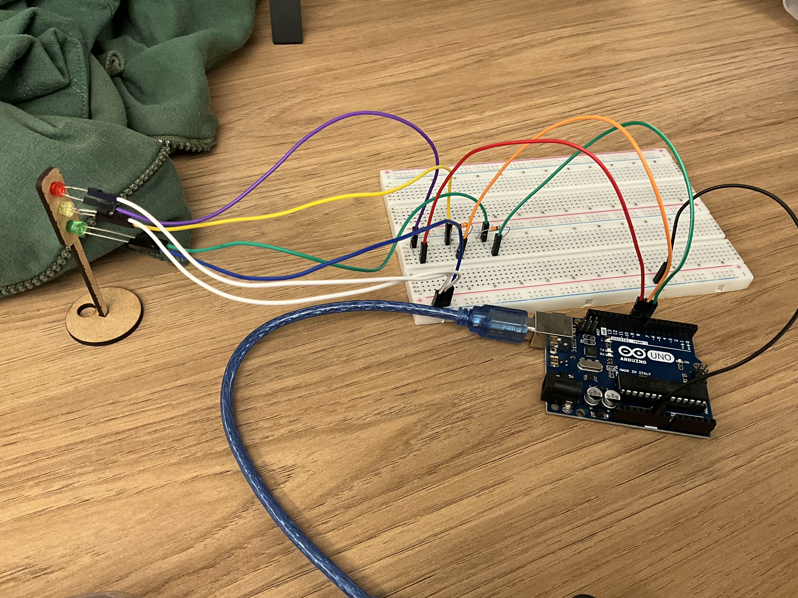

# Semáforo LED com Arduino
  
### Peças usadas:
- Arduino UNO
- 3x LED 5mm (vermelho, amarelo, verde)
- 3x Resistor 330 Ohms 5%
- Cabos jumper M-M e M-F

https://github.com/user-attachments/assets/82f47520-97b1-4e4e-be33-be8d310c36c5

### Avaliadora: Sophia Senne
| Critério                                                                                                 | Contempla (Pontos) | Contempla Parcialmente (Pontos) | Não Contempla (Pontos) | Observações do Avaliador |
|---------------------------------------------------------------------------------------------------------|--------------------|----------------------------------|--------------------------|---------------------------|
| Montagem física com cores corretas, boa disposição dos fios e uso adequado de resistores                | Até 3              | Até 1,5                            | 0                        | 3                          |
| Temporização adequada conforme tempos medidos com auxílio de algum instrumento externo                  | Até 3              | Até 1,5                          | 0                        | 3                          |
| Código implementa corretamente as fases do semáforo e estrutura do código (variáveis representativas e comentários) | Até 3              | Até 1,5                          | 0                        | 3                          |
| Extra: Implmeentou um componente de liga/desliga no semáforo e/ou usou ponteiros no código | Até 1              |  Até 0,5                         | 0                        | 1                          |
| **Pontuação Total:** |                                                             |  | |**10**|

### Avaliadora: Karine Victoria
| Critério                                                                                                 | Contempla (Pontos) | Contempla Parcialmente (Pontos) | Não Contempla (Pontos) | Observações do Avaliador |
|---------------------------------------------------------------------------------------------------------|--------------------|----------------------------------|--------------------------|---------------------------|
| Montagem física com cores corretas, boa disposição dos fios e uso adequado de resistores                | Até 3              | Até 1,5                            | 0                        | 3                          |
| Temporização adequada conforme tempos medidos com auxílio de algum instrumento externo                  | Até 3              | Até 1,5                          | 0                        | 3                          |
| Código implementa corretamente as fases do semáforo e estrutura do código (variáveis representativas e comentários) | Até 3              | Até 1,5                          | 0                        | 3                          |
| Extra: Implmeentou um componente de liga/desliga no semáforo e/ou usou ponteiros no código | Até 1              |  Até 0,5                         | 0                        | 1                          |
| **Pontuação Total:** |                                                             |  | |**10**|
